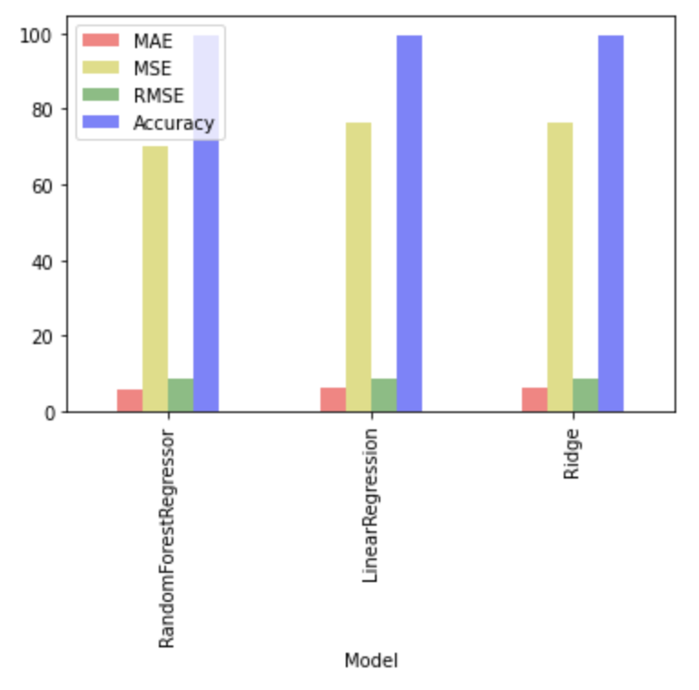
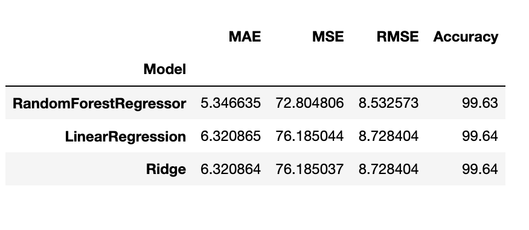

# Gold Prices

  - Introduction .
    - Goal: Predict the upcoming gold prices. :)
    
  - Dataset Overview and Source.
    - Data secure : https://sa.investing.com/commodities/gold-historical-data 
    - About Dataset
Historically gold coinage was widely used as currency; when paper money was introduced, it typically was a receipt redeemable for gold coin or bullion. In a monetary system known as the gold standard, a certain weight of gold was given the name of a unit of currency. For a long period, the United States government set the value of the US dollar so that one troy ounce was equal to $20.67 ($0.665 per gram), but in 1934 the dollar was devalued to $35.00 per troy ounce ($0.889/g). By 1961, it was becoming hard to maintain this price, and a pool of US and European banks agreed to manipulate the market to prevent further currency devaluation against increased gold demand.

- Compares the final results of models:
 
- Final conclusion and recommendations:
  - The ounce price is expected to drop to $1,300 in the first quarter of 2023, after which prices are expected to rise by the end of the first quarter and the beginning of the second quarter.
During the fourth quarter of 2023, the price per ounce is expected to range between $1,600 and $1,700. Therefore, we recommend buying in the first quarter of 2023.

  - Final results of ML models:
  

  - Team members.
    - Rawabe Ebrahim
    - Dalal Aldulim
